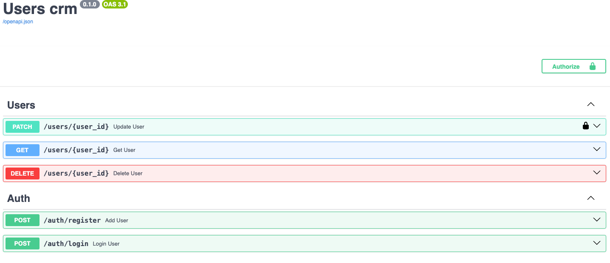

### Environment Variables

- Configure additional environment variables, refer to the `.env.example` file and create a `.env` file based on it.

### Running the Application

1. Configure additional environment variables, refer to the `.env.example` file and create a `.env` file based on it.
2. Run `make run`. This command sets up the containers (app, MongoDB, RabbitMQ).
3. If it's the first time you're running the application, execute `make init_db` after `make run`. This will create a default admin user with the following credentials:
   - `email='admin@example.com'`
   - `password='admin123'`
   - `role='admin'`
4. Only a logged-in admin user can update another user's profile and assign admin roles or other privileges.
5. To run tests, use `make test`.

### API Documentation

1. The API documentation is available at: `http://127.0.0.1:8000/docs`

